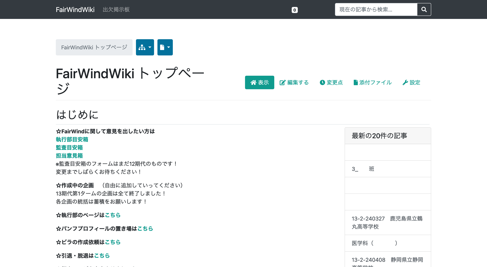

# プラットフォーム担当部分

担当体験会へようこそ！

FairWind 12期で、前のタームのプラットフォーム担当長の薬師神晴悟（工学部社会基盤学科4年）です。

この「担当体験会」では、ホームページ担当とプラットフォーム担当の2つの担当の普段の業務のごく一部を体験していただきます。
あまりプログラミングに馴染みのない方でも楽しんでいただけるように準備したつもりですので、楽しんで帰っていただければと思います。

## プラットフォーム担当とは

ざっくり言うと、FairWind のさまざまな業務を情報技術を使って効率化することを目指す担当です。

独自の Wiki や出欠掲示板と呼ばれるシステムを開発・運用しています。



これらのシステムは、FairWind の活動を支えるために開発されたもので、FairWind のメンバーが日々の活動を行う上で欠かせないものとなっています。

やや技術的な話をすると、Python というプログラミング言語と、Django という Python のフレームワークを用いて開発されています。

Python 自体は情報やアルゴリズム入門等の駒場の授業でも触れるものですので、プログラミングに馴染みのない方でも比較的とっつきやすい言語だと思います。

## 体験内容

今日は、プラットフォーム担当の業務の一部として、簡単なプログラミングをしていただきます。

前述の通り、FairWind のシステムは Python と Django を用いて開発されていますが、Django はやや複雑なフレームワークであるため、今回は Django ではなく、Flask というよりシンプルなフレームワークを使ってプログラミングをしていただきます。

「プログラミング」と言ってもコードをコピペするくらいで大丈夫ですので、ご安心ください。

### はじめに

みなさんの手元に準備されているパソコンには、すでに Python と Flask の環境が整えられています。
追加の環境構築は不要です。

### 簡単な HTML を表示させてみよう

HTML は Hyper Text Markup Language の略で、Web ページを作成するための言語です。

まずは、`Hello World!` と表示するだけのページを作成してみましょう。

`app.py` を開いて、以下のコードを追加してください。

```python
@app.route("/hello-world")
def hello_world():
    return "<h1>Hello World!</h1>"
```

このコードは、`/hello-world` という URL にアクセスしたときに `Hello World!` と表示するというものです。

<http://localhost/hello-world/> にアクセスして表示を確認してみてください。

### 動的なページを表示させてみよう

先ほどのページはいつ誰がアクセスしても `Hello World!` と表示されるだけでしたが、実際の Web アプリでは、ユーザーが入力した内容に応じて表示を変えることがよくあります。

例えば、現在の時刻を動的に表示するページを作成してみましょう。

`app.py` を開いて、以下のコードを追加してください。

```python
from datetime import datetime

@app.route("/time")
def time():
    return f"<h1>現在の時刻: {datetime.now()}</h1>"
```

このコードは、`/time` という URL にアクセスしたときに、その時の時刻を表示するというものです。

<http://localhost/time/> にアクセスして表示を確認してみてください。

何回かリロードしてみると、表示が変わることがわかると思います。

### テンプレートを使ってみよう

先ほどは、Python のコードの中に HTML を直接書いていましたが、実際の Web アプリでは、HTML を別ファイルに書いておいて、Python のコードからそれを読み込んで表示することがよくあります。

これは、Python のコードに HTML のコードを書くと管理が煩雑になるためです。

あくまでも Web ページをユーザーに届けるためのコードは Python で書き、その中で表示する内容は HTML で書くという分業の考え方です。

まずは、`templates` ディレクトリに `fairwind.html` というファイルを作成して、以下のコードを書いてください。

```html
<!DOCTYPE html>

<html lang="ja">
<head>
    <meta charset="UTF-8">
    <title>FairWind</title>
</head>
<body>
    <h1>FairWind</h1>
    <p>担当体験会へようこそ！</p>
    <p>現在の時刻: {{ now }}</p>
</body>
</html>
```

次に、`app.py` を開いて、以下のコードを追加してください。

```python
@app.route("/fairwind")
def fairwind():
    now = datetime.now()
    return render_template("fairwind.html", now=now)
```

このコードは、`/fairwind` という URL にアクセスしたときに、`templates` ディレクトリにある `fairwind.html` を表示するというものです。

<http://localhost/fairwind/> にアクセスして表示を確認してみてください。

テンプレートの中の `{{ now }}` は、Python のコードから渡された変数 `now` の値を表示するための記法です。
画面に表示される時刻が変わることがわかると思います。

### おわりに

これで、Python を使って簡単な Web アプリを作成することができました。

今回みなさんに体験していただいたことは基礎の基礎に過ぎず、実際はデータベースと連携したりユーザーを認証したりといった機能を持たせています。
しかし、Python と HTML で開発をしているという点は変わりません。

もっと複雑な Web アプリを作ってみたいという方は、ぜひ FairWind に入ってください！

この後は、ホームページ担当の担当部分に移ります。
